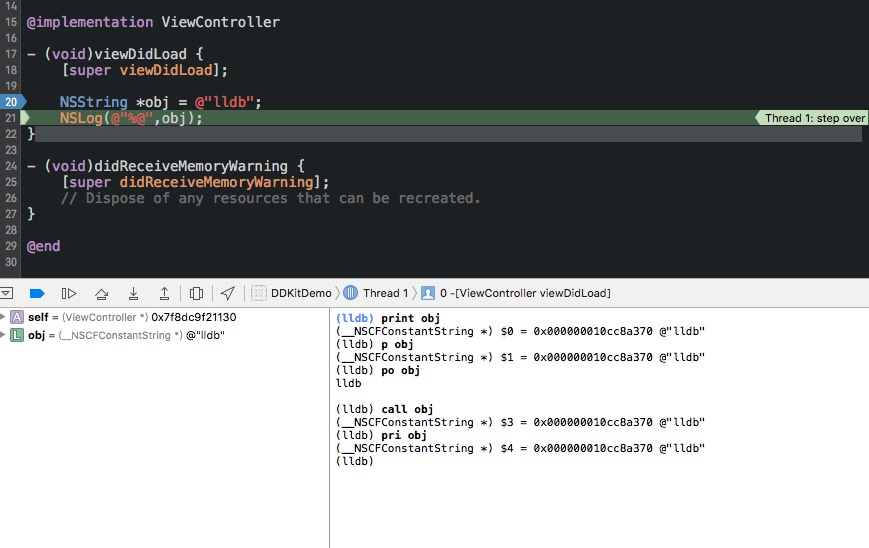

## LLDB

#### LLDB简介

[LLDB](http://lldb.llvm.org/)是一个开源的插件，现在Xcode内部已经集成了这个调试器，可以在程序运行的时候暂停、打印变量，执行自定义的指令。可以避免重复的编译运行app,打印Log调试。

Facebook也开源了一个插件[chisel](https://github.com/facebook/chisel), 简化收集了一些LLDB的命令。


#### LLDB使用方法

###### 打印
基本命令：`p`、`print`、`po`、`call`




+	其实lldb会做一些前缀的匹配，也就是 `p`和`print`是相同的结果
+	`p`和`print`是按照对象的`description`方法的结果
+	$0 这是存在于LLDB的命名空间的，相当于一个临时变量的存在，可以直接使用

###### 改变变量的值 

基本命令：`expression`

```
(lldb) expression obj = @"change lldb"
(__NSCFString *) $5 = 0x00007f8dc9f02c50 @"change lldb"
(lldb) po obj
change lldb

(lldb) print obj
(__NSCFString *) $7 = 0x00007f8dc9f02c50 @"change lldb"
(lldb) 
```

###### 控制流程
`c` : continue
`n` : next (step over按钮)
`s` : step in 跳进某个函数
`frame info`: 当前行数和源码文件

###### 断点
`br li`: 查看所有断点

创建断点:`b ViewController.m:20`

```
	b resignFirstResponder //给所有控件的resignFirstResponder断点
```
#### LLDB进阶
查看崩溃地址的错误信息

```
	image lookup --address 0x7f9f2ad9f960
```


#### 参考资料

1. [http://objccn.io/issue-19-2/](http://objccn.io/issue-19-2/)
2. 